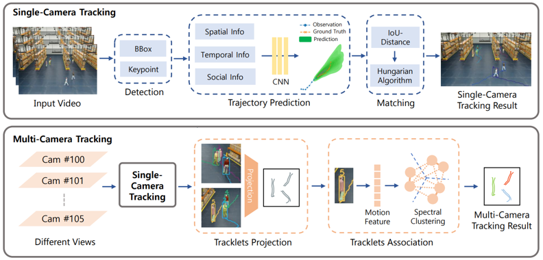

# [CVPRW2023] "Leveraging Future Trajectory Prediction for Multi-Camera People Tracking"

[Track1: Multi-Camera People Tracking](https://www.aicitychallenge.org/2023-challenge-tracks/)

The official repository for [7th NVIDIA AI City Challenge](https://www.aicitychallenge.org/)

## Pipeline Overview

<p align="center"></p>

## Environment

We run on 2 NVIDIA A6000 GPUs.

- Linux or macOS
- Python 3.7+  (Python 3.8 in our envs)
- PyTorch 1.9+ (1.11.0 in our envs)
- CUDA 10.2+ (CUDA 11.3 in our envs)
- mmcv-full==1.7.1 ([MMCV](https://mmcv.readthedocs.io/en/latest/#installation))

## Installation

- Step #1. Create environment (recommend environment)

```bash 
conda env create --file environment.yaml
conda activate scit
```

- Step #2. Install packages

```bash 
sh setup.sh
```

## Train

<details open>
<summary>Object Detection</summary>

- **Train on Dataset**

  We use [mmdetection](https://github.com/open-mmlab/mmdetection)'s [YOLOX-X](https://github.com/open-mmlab/mmdetection/tree/main/configs/yolox) model.
    
  Follow mmdetection's [guideline](https://mmdetection.readthedocs.io/en/latest/user_guides/index.html) for training.

- **Pretrained**

  Pretrained person detection model weights on NVIDIA Omniverse Dataset from 2023 AI City Challenge Track1.
    
  [pretrained-YOLOX-X.pth](https://drive.google.com/file/d/1nSjmGr904Kj4xHYLscc3n0YTDw9eOC_7/view?usp=share_link)
    
</details>


<details open>
<summary>Keypoint Detection</summary>

- **Pretrained**

  We directly use [yolov7-pose-estimation](https://github.com/RizwanMunawar/yolov7-pose-estimation)'s pretrained pose estimation model.
    
  You can download pretrained pose estimation model from their git page.
    
</details>


<details open>
<summary>Trajectory Prediction</summary>

- **Train on Dataset**

  We use [Social-Implicit](https://github.com/abduallahmohamed/Social-Implicit) model.

- **Pretrained**

  Pretrained trajectory prediction model weights on NVIDIA Omniverse Dataset from 2023 AI City Challenge Track1.
    
  [pretrained-social-implicit.pth](https://drive.google.com/file/d/18JdTYqspMjPQjex7Ncrt4J7DJ29iJKi0/view?usp=share_link)
    
</details>


## Demo

- Step #1. Single-Camera Tracking.

```bash 
sh run_scmt.sh
```

- Step #2. Multi-Camera Tracking (Association).
  Here is the [homography_list.pkl](https://drive.google.com/file/d/1WUrqysoEfde2mAU9G4gwE-HVGermune7/view?usp=sharing).

```bash 
sh run_mcmt.sh
```

## Citation
```
@InProceedings{Jeon_2023_CVPR,
    author    = {Jeon, Yuntae and Tran, Dai Quoc and Park, Minsoo and Park, Seunghee},
    title     = {Leveraging Future Trajectory Prediction for Multi-Camera People Tracking},
    booktitle = {Proceedings of the IEEE/CVF Conference on Computer Vision and Pattern Recognition (CVPR) Workshops},
    month     = {June},
    year      = {2023},
    pages     = {5398-5407}
}
```
